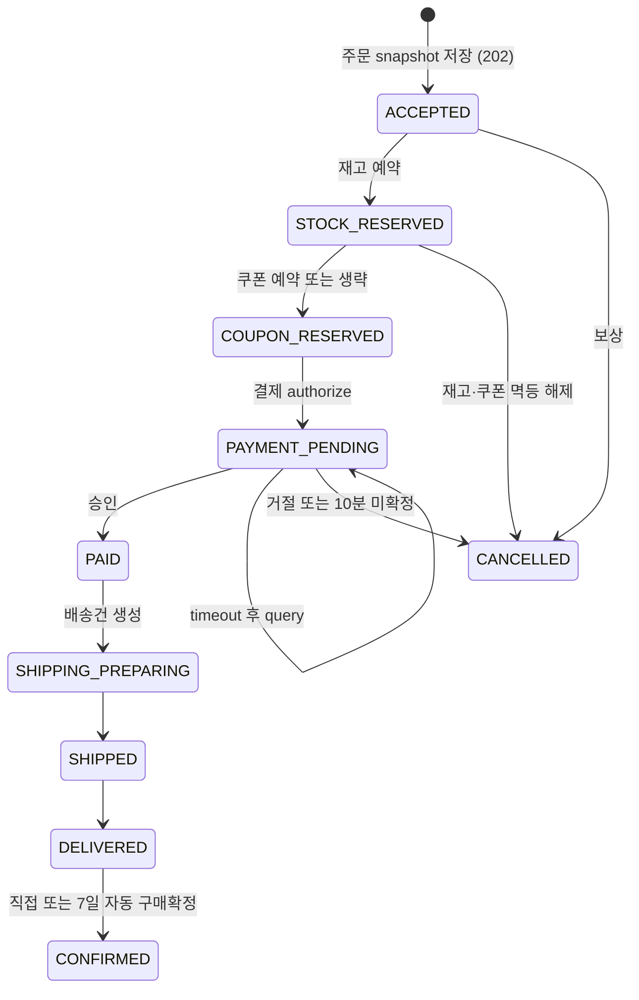

# 주문 상태수렴

주문 요청은 가격, 상품명, SKU와 배송지 snapshot을 저장한 뒤 `202 Accepted`를 반환합니다. listener는 event ID 처리 기록과 aggregate idempotency key를 사용해 적어도 한 번 전달의 중복을 무해하게 만듭니다. 결제 결과가 불명확하면 10초 간격으로 조회하고 10분 안에 확정되지 않으면 취소로 수렴합니다.

출고 전 전체 주문 취소만 지원합니다. 부분취소, 반품과 환불은 범위 밖입니다.
